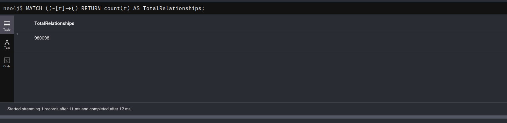

# 🔍 Fraud Detection Dataset Analysis with Neo4j

This project analyzes a fraud detection dataset using **Neo4j**, a graph database. It explores the dataset’s graph structure, including nodes, relationships, and schema visualization, to uncover insights helpful for detecting fraudulent activities.

---

## 📦 Dataset Overview

This dataset represents entities and interactions commonly involved in fraud detection, such as users, transactions, devices, IP addresses, merchants, etc. These are modeled as **nodes**, and their interactions (e.g., performed, owns, accessed from) are **relationships** in the graph.

---

## 📊 Graph Analysis

### 1. Schema Visualization

To visualize the schema and understand how different entities are connected:

```cypher
CALL db.schema.visualization();
```


### 2. Total Nodes Count

Count the total number of nodes in the graph:

```cypher
MATCH (n) 
RETURN count(n) AS TotalNodes;
```


### 3. Total Relationships Count

Count the total number of relationships:

```cypher
MATCH ()-[r]->() 
RETURN count(r) AS TotalRelationships;
```



### 4. Node Labels and Their Counts

List all node labels and the number of nodes per label:

```cypher
MATCH (n)
RETURN labels(n) AS Label, count(*) AS Count
ORDER BY Count DESC;
```


### 5. Relationship Types and Their Counts

List all relationship types and their frequency:

```cypher
MATCH ()-[r]->()
RETURN type(r) AS RelationshipType, count(r) AS Count
ORDER BY Count DESC;
```


### 6. What types of transactions do Clients perform with First Party Fraudsters?

```cypher
MATCH (:Client:FirstPartyFraudster)-[]-(txn:Transaction)-[]-(c:Client)
WHERE NOT c:FirstPartyFraudster
UNWIND labels(txn) AS transactionType
RETURN transactionType, count(*) AS frequency
ORDER BY frequency DESC
```


### 7. How many clusters of Fraud Rings have more than 9 client nodes?

```cypher
CALL gds.wcc.stream('wcc')
YIELD componentId, nodeId
WITH componentId, collect(gds.util.asNode(nodeId)) AS nodes
WITH componentId, nodes, size(nodes) AS clusterSize
WHERE clusterSize > 9
UNWIND nodes AS client
MATCH (client)-[:SHARED_IDENTIFIERS]-(others:Client)
WHERE others IN nodes
RETURN client, others;
```


### 8. How many clusters of Fraud Rings have more than 10 client nodes?

```cypher
CALL gds.wcc.stream('wcc')
YIELD componentId, nodeId
WITH componentId, collect(gds.util.asNode(nodeId)) AS nodes
WITH componentId, nodes, size(nodes) AS clusterSize
WHERE clusterSize > 10
UNWIND nodes AS client
MATCH (client)-[:SHARED_IDENTIFIERS]-(others:Client)
WHERE others IN nodes
RETURN client, others;
```

