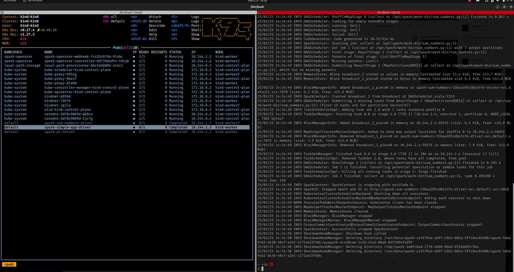

# Spark on Kubernetes with Spark Operator

This guide provides step-by-step instructions to set up and run a simple Spark application on a Kubernetes cluster using the Spark Operator.

## Getting Started

For detailed documentation, refer to the [official guide](https://www.kubeflow.org/docs/components/spark-operator/getting-started/).

### 1. [OPTIONAL] Download Spark

Download and extract the latest Spark binary compatible with Hadoop:

```bash
wget https://www.apache.org/dyn/closer.lua/spark/spark-3.5.5/spark-3.5.5-bin-hadoop3.tgz
tar -xvzf spark-3.5.5-bin-hadoop3.tgz
```

### 2. Build the SimpleApp Docker Image

Navigate to the root project directory and build the Docker image:

```bash
docker build -t spark-py:simple-app simple-app/
```

### 3. Create a Kubernetes Cluster with Kind

Set up a local Kubernetes cluster using Kind:

```bash
kind create cluster
kind load docker-image spark-py:simple-app
```

### 4. Deploy the Spark Operator

Install the Spark Operator using Helm:

```bash
helm repo add spark-operator https://kubeflow.github.io/spark-operator
helm repo update
helm install spark-operator spark-operator/spark-operator \
    --namespace spark-operator \
    --create-namespace
```

### 5. Configure Permissions

Create a `ClusterRoleBinding` to allow Spark jobs to run:

```bash
kubectl create clusterrolebinding spark-role --clusterrole=edit --serviceaccount=default:default --namespace=default
```

### 6. Deploy and Run the Spark Application

Apply the Spark application manifest:

```bash
kubectl apply -f simple-app/sparkApp.yaml
```

## Outcome



