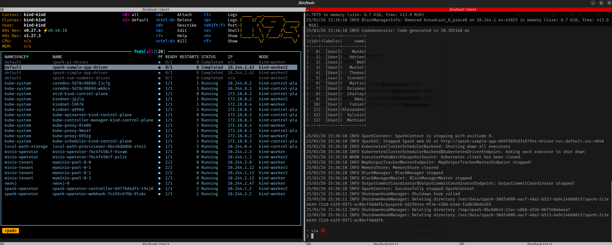

# Spark on Kubernetes with Spark Operator

This guide provides step-by-step instructions to set up and run Spark applications on a Kubernetes cluster using the Spark Operator. It showcases two distinct examples: reading data from MinIO and querying Neo4j.

## Applications

- **SimpleApp** is a Spark application that retrieves a file from MinIO and displays its content using PySpark.
- **SampleApp** is a Spark application that connects to a Neo4j instance using the Neo4j Spark Connector and runs a Cypher query (`CALL db.schema.visualization`) to retrieve schema information.
- **DataAnalysisApp** is a Spark application that loads the `wikipedia.dat` file from MinIO, extracts fields (like categories), transforms the raw data into a DataFrame, and counts the top 50 most frequent categories.

## Getting Started

For detailed documentation, refer to the [official Spark Operator guide](https://www.kubeflow.org/docs/components/spark-operator/getting-started/).

### 1. [OPTIONAL] Download Spark

Download and extract the latest Spark binary compatible with Hadoop:

```bash
wget https://www.apache.org/dyn/closer.lua/spark/spark-3.5.5/spark-3.5.5-bin-hadoop3.tgz
tar -xvzf spark-3.5.5-bin-hadoop3.tgz
```

### 2. Create a Kubernetes Cluster with Kind

Set up a local Kubernetes cluster using Kind:

```bash
kind create cluster
kind load docker-image spark-py:simple-app
```

### 3. Deploy the Spark, MinIO, and Neo4j

Install using Helm:

```bash
# Spark Operator
helm repo add spark-operator https://kubeflow.github.io/spark-operator
helm repo update
helm install spark-operator spark-operator/spark-operator \
    --namespace spark-operator \
    --create-namespace

# MinIO Operator
helm repo add minio-operator https://operator.min.io
helm install \
  --namespace minio-operator \
  --create-namespace \
  operator minio-operator/operator

# Neo4j
helm repo add neo4j https://helm.neo4j.com/neo4j
helm install neo4j neo4j/neo4j \
    --namespace neo4j \
    --create-namespace \
    --set neo4j.name=neo4j-instance \
    --set volumes.data.mode=defaultStorageClass
kubectl apply -f kubernetes/tenantMinio.yaml
```

### 4. Configure Permissions

Create a `ClusterRoleBinding` to allow Spark jobs to run:

```bash
kubectl create clusterrolebinding spark-role \
  --clusterrole=edit \
  --serviceaccount=default:default \
  --namespace=default
```

### 5. Uploaded Files in MinIO

Upload:
- `SampleApp.py` (from **apps/sample-app/**) to the `python` bucket via the MinIO web interface.
- `SimpleApp.py` (from **apps/simple-app/**) to the `python` bucket via the MinIO web interface.
- `DataAnalysisApp.py` (from **apps/data-analysis/**) to the `python` bucket via the MinIO web interface.
- `README.md` to the `documents` bucket via the MinIO web interface.

### 6. Run the Spark Applications

- Run SimpleApp (MinIO):

```bash
kubectl apply -f kubernetes/simple-app/sparkApplication-v2.yaml
```

- Run SampleApp (Neo4j):

```bash
kubectl apply -f kubernetes/sample-app/sparkApplication.yaml
```

- Run DataAnalysisApp (Wikipedia):

```bash
kubectl apply -f kubernetes/data-analysis/sparkApplication.yaml
```

## Outcome

### Spark Reading from MinIO


### Spark Querying Neo4j


### Spark Top 50 Wikipedia Categories

